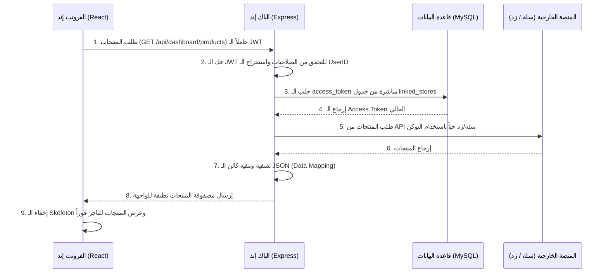

# 📖 الدليل التفصيلي الشامل لبنية وهيكلية مشروع (DashAI) - المحدث

يرحب بك هذا الدليل البرمجي الشامل في مشروع **DashAI**. تم تحديث هذا الملف لشرح الهيكلية البرمجية المعتمدة للمشروع بالتفصيل الممل بعد اعتماد **التبسيط الذكي لبيانات المتاجر وقواعد البيانات**؛ حيث قمنا بدمج معلومات المتجر ورموز التفويض (Tokens) في جدول موحد ومستقل وهو `linked_stores` لتسهيل جلب البيانات وتفادي العلاقات المعقدة حالياً.

---

## 🧭 الفهرس العام للدليل
1. **فلسفة البنية الهيكلية للمشروع (Decoupled Monolith)**
2. **أولاً: تفصيل ملفات الواجهة الخلفية (Backend - Express.js & MySQL & Sequelize)**
3. **ثانياً: تفصيل ملفات الواجهة الأمامية (Frontend - React.js & Vite)**
4. **ثالثاً: التدفق المنطقي التفصيلي للبيانات (OAuth & Live Sync)**
5. **رابعاً: إرشادات الأداء، وتفادي مشاكل الذاكرة و re-renders الشائعة**
6. **خامساً: كيفية تشغيل المهاجرات (Migrations) والتحكم بقاعدة البيانات**

---

## 🏛️ 1. فلسفة البنية الهيكلية للمشروع (Decoupled Monolith)
يعتمد مشروع **DashAI** على فصل كامل ومحكم بين:
1. **الفرونت إند (React + Vite):** خفيف الوزن، يعتمد على الـ Static Assets ويتم استضافته على Vercel أو Hostinger، وتكمن وظيفته فقط في عرض الواجهات والتصاميم والتفاعل مع التاجر وإرسال طلبات الـ HTTP إلى الباك إند.
2. **الباك إند (Express.js):** يعمل على خادم مستمر (Persistent Server) على Hostinger، وهو الرأس المفكر الذي يتصل بقاعدة البيانات (MySQL) ويحفظ مفاتيح الربط والتفويض ويقوم بالتواصل المباشر الآمن (Server-to-Server) مع خوادم سلة وزد.
3. **قاعدة البيانات (MySQL):** مستضافة على Hostinger لإدارة بيانات التجار وحفظ الرموز السرية للمتاجر المربوطة.

هذا الفصل يحمي بياناتك السرية (مثل Client Secrets الخاصة بسلة وزد) من التسرب في الفرونت إند، كما يضمن استقلالية التطبيق وسرعة تشغيله وقابليته للتوسع المستقبلي.

---

## 💻 2. تفصيل ملفات الواجهة الخلفية (Backend)

يحتوي مجلد `backend` على الهيكل البرمجي التالي، وفيما يلي تفصيل كل ملف بمحتواه وفائدته:

### 📁 المجلد الرئيسي `backend/`

#### 📄 `backend/server.js`
*   **الوظيفة:** نقطة الانطلاق الرئيسية والمدخل الأساسي لسيرفر Express.js.
*   **المحتوى الحالي:**
    *   استدعاء المكتبات الأساسية (`express`, `cors`, `dotenv`).
    *   إعداد بيئة العمل عبر تحميل متغيرات ملف `.env`.
    *   استيراد وتفعيل الـ Routes الرئيسية للمشروع (Auth & Dashboard).
    *   استيراد ملف قاعدة البيانات `db.js` لعمل اختبار اتصال Sequelize تلقائي عند تشغيل السيرفر.
*   **أين يستدعى:** يتم تشغيله بواسطة Node.js مباشرة عبر الأمر `npm run dev` (المقترن بـ `nodemon`).
*   **فائدته:** يمثل عمود الخيمة للمشروع؛ فكل الطلبات القادمة من الفرونت إند تمر عبر هذا الملف ليتم توجيهها للمسار الصحيح.

#### 📄 `backend/.env`
*   **الوظيفة:** تخزين المتغيرات البيئية السرية والإعدادات الحساسة الخاصة بالنظام.
*   **المحتوى الحالي:**
    *   رقم المنفذ `PORT=5000`.
    *   بيانات الاتصال بقاعدة بيانات MySQL المحلية لـ phpMyAdmin (`DB_HOST=localhost`, `DB_USER=root`, `DB_PASSWORD=12345678`, `DB_NAME=dashai_db`).
    *   مفاتيح تطبيق سلة (`SALLA_CLIENT_ID`, `SALLA_CLIENT_SECRET`).
    *   مفاتيح تطبيق زد (`ZID_CLIENT_ID`, `ZID_CLIENT_SECRET`).
*   **أين يستدعى:** يتم تحميله في `server.js` و `config.cjs` باستخدام مكتبة `dotenv` لتصبح المتغيرات متاحة عبر `process.env.VARIABLE_NAME`.
*   **فائدته:** يعزل البيانات الحساسة عن كود المصدر، مما يمنع تسريب كلمات المرور والمفاتيح السرية للمنصات عند رفع المشروع إلى Git.

#### 📄 `backend/package.json`
*   **الوظيفة:** تعريف المشروع وإدارته وتسجيل الاعتمادات والحزم البرمجية وسكريبتات التحكم.
*   **المحتوى الحالي:**
    *   اسم المشروع وإصداره ونوعه كـ `ES Modules` (`"type": "module"`).
    *   **أوامر التشغيل المدمجة للهجرة والتحكم بقاعدة البيانات دون الحاجة لملفات توجيه:**
        *   `npm run dev`: لتشغيل السيرفر مع المراقبة التلقائية بـ `nodemon`.
        *   `npm run db:migrate`: لتشغيل الـ Migration وبناء جدول `linked_stores` تلقائياً.
        *   `npm run db:migrate:undo`: للتراجع عن الميجريشن الأخير وحذف الجدول للتعديل عليه.
    *   قائمة الحزم التابعة (`dependencies`): `express`, `cors`, `dotenv`, `mysql2`, `axios`, `sequelize`.
*   **أين يستدعى:** يستخدمه مدير الحزم `npm` لتثبيت التبعيات وتشغيل السكريبتات.
*   **فائدته:** يضمن أن أي مطور أو بيئة استضافة ستقوم بتشغيل المشروع ستحصل على نفس الحزم وبنفس الإصدارات البرمجية المحددة بدقة.

---

### 📁 المجلد الفرعي `backend/src/config/`

#### 📄 `backend/src/config/db.js`
*   **الوظيفة:** تأسيس كائن Sequelize وتكوين الاتصال بقاعدة البيانات.
*   **المحتوى الحالي:**
    *   استيراد مكتبة `sequelize`.
    *   تهيئة الكائن وتغذيتها بمتغيرات البيئة لـ MySQL.
    *   تفعيل ميزة الـ `pool` لإعادة استخدام الاتصالات بكفاءة والحد من الجلسات المفتوحة.
    *   اختبار الاتصال تلقائياً `sequelize.authenticate` عند تشغيل السيرفر وطباعة تنبيه النجاح/الفشل بالـ Terminal.
*   **أين يستدعى:** يستورد داخل ملفات الـ Controllers التي تحتاج لقراءة أو كتابة بيانات المتاجر، ويستورد مؤقتاً في `server.js` للاختبار.
*   **فائدته:** يمثل محرك الـ ORM في المشروع؛ بدلاً من كتابة استعلامات SQL خام، يمكننا استدعاء دوال الموديل مباشرة للتعامل مع قاعدة البيانات.

#### 📄 `backend/src/config/config.cjs`
*   **الوظيفة:** توفير إعدادات الاتصال بـ MySQL لأداة الـ CLI التابعة لـ Sequelize.
*   **المحتوى الحالي:**
    *   قراءة الـ `.env` وتصدير إعدادات بيئات التطوير والإنتاج بصيغة CommonJS متوافقة مع الـ CLI.
*   **أين يستدعى:** تقرأه أداة الـ CLI تلقائياً عند تنفيذ أوامر `db:migrate`.
*   **فائدته:** يربط الـ CLI بقاعدة البيانات ويساعده على معرفة كلمة مرور واسم قاعدة بياناتك لتطبيق الهجرات البرمجية.

---

### 📁 المجلد الفرعي `backend/src/models/`

#### 📄 `backend/src/models/LinkedStore.js`
*   **الوظيفة:** الموديل الموحد والوحيد لتمثيل جدول المتاجر المتصلة في قاعدة البيانات.
*   **المحتوى الحالي:**
    *   حقل معرف المتجر التلقائي `id` (PK).
    *   معرف المستخدم `user_id` لتنسيق الجلسة محلياً.
    *   نوع المنصة `platform` كـ Enum يقبل فقط (`salla`, `zid`).
    *   معرف المنصة الفريد للمتجر `platform_store_id`.
    *   **رموز الوصول والتوكنات المخزنة مباشرة لتبسيط جلب البيانات:**
        *   `accessToken`: رمز التفويض الفعال.
        *   `refreshToken`: رمز التجديد التلقائي.
        *   `managerToken`: التوكن الإداري لـ زد.
        *   `expiresAt`: تاريخ انتهاء الصلاحية.
*   **أين يستدعى:** يستورد داخل الـ Controllers التي تدير عمليات الـ OAuth وجلب البيانات.
*   **فائدته:** يمثل الكائن البرمجي الوحيد الذي سنتعامل معه لقراءة وتحديث الـ Tokens بدون علاقات معقدة.

#### 📄 `backend/src/models/index.js`
*   **الوظيفة:** ملف التجميع والتصدير المركزي للموديلات وقاعدة البيانات.
*   **المحتوى الحالي:**
    *   استيراد وتصدير كائن الاتصال `sequelize` والموديل الموحد `LinkedStore`.
*   **أين يستدعى:** يتم استيراده في الـ Controllers كمدخل وحيد لجميع موديلات المشروع.
*   **فائدته:** ينظم عمليات الاستيراد ويمنع تكرار الأسطر البرمجية في الـ Controllers.

---

### 📁 المجلد الفرعي `backend/src/controllers/`

#### 📄 `backend/src/controllers/sallaAuthController.js`
*   **الوظيفة:** معالجة منطق تفويض وربط منصة سلة (OAuth 2.0 Flow).
*   **المحتوى المفترض:**
    *   `handleSallaRedirect`: دالة للتوجيه لبوابة دخول سلة.
    *   `handleSallaCallback`: مقايضة كود التفويض بالتوكنات وحفظها فوراً في جدول `linked_stores` باستخدام `LinkedStore.upsert()`.
*   **أين يستدعى:** يتم ربطه بالمسار في `routes/auth.js`.

#### 📄 `backend/src/controllers/zidAuthController.js`
*   **الوظيفة:** معالجة منطق تفويض وربط منصة زد (OAuth 2.0 Flow).
*   **المحتوى المفترض:**
    *   `handleZidRedirect` و `handleZidCallback` لحفظ التوكنات ومعرف متجر زد في جدول `linked_stores`.
*   **أين يستدعى:** يتم ربطه بالمسار في `routes/auth.js`.

#### 📄 `backend/src/controllers/dashboardController.js`
*   **الوظيفة:** معالجة طلبات لوحة التحكم وتغذيتها بالبيانات الحية المحدثة.
*   **المحتوى المفترض:**
    *   `getProducts`: تقرأ توكن المتجر مباشرة من جدول `linked_stores` وتطلب البيانات من خدمة سلة/زد.
*   **أين يستدعى:** يتم ربطه بالمسار في `routes/dashboard.js`.

---

### 📁 المجلد الفرعي `backend/src/routes/`

#### 📄 `backend/src/routes/auth.js`
*   **الوظيفة:** مسارات الـ OAuth الخاصة بالمنصتين تحت البادئة `/api/auth`.

#### 📄 `backend/src/routes/dashboard.js`
*   **الوظيفة:** مسارات البيانات المحمية بـ الـ Middleware تحت البادئة `/api/dashboard`.

---

### 📁 المجلد الفرعي `backend/database/migrations/`

#### 📄 `backend/database/migrations/20260628160000-create-linked-stores.cjs`
*   **الوظيفة:** ملف الهجرة البرمجية المسؤول عن بناء جدول `linked_stores` في MySQL.
*   **المحتوى الحالي:**
    *   توليد الجداول وحقول التوكنات، وتعريف القيود والـ Unique Index على المنصة ومعرف المتجر لعدم تكرار ربط نفس المتجر مرتين.
*   **أين يستدعى:** يتم تشغيله بواسطة Sequelize CLI عبر الأمر `npm run db:migrate`.
*   **فائدته:** يبني الجداول بدقة تامة وبصيغة مطابقة للموديل البرمجي لضمان توافق قواعد البيانات.

---

## 🎨 3. تفصيل ملفات الواجهة الأمامية (Frontend)

يحتوي مجلد `frontend` على هيكل مشروع React المحدث والمصمم لتجنب المشاكل البرمجية وتسهيل التشغيل على أي استضافة:

### 📁 المجلد الفرعي `frontend/src/services/`

#### 📄 `frontend/src/services/apiClient.ts`
*   **الوظيفة:** كائن Axios مركزي يوجه الطلبات لـ الباك إند (`http://localhost:5000/api`) ويحقن الـ JWT تلقائياً.

---

### 📁 المجلد الفرعي `frontend/src/routes/`

#### 📄 `frontend/src/routes/AppRoutes.tsx`
*   **الوظيفة:** نظام التوجيه المركزي والكسول (Lazy Loading) لحماية وعرض صفحات لوحة التحكم.

---

### 📁 المجلد الفرعي `frontend/src/components/`

#### 📄 `frontend/src/components/Layout.jsx` و `Button.jsx` و `LoadingSkeleton.jsx`
*   **الوظيفة:** مكونات الواجهة الرسومية الثابتة ولوحة التحكم وشاشات التحميل التفاعلية الأنيقة.

#### 📄 `frontend/src/components/ProtectedRoute.tsx`
*   **الوظيفة:** حماية لوحة التحكم محلياً بالتحقق من الجلسة في الـ `localStorage`.

---

### 📁 المجلد الفرعي `frontend/src/features/`

#### 📄 `frontend/src/features/products/hooks/useProducts.js` و `OrdersPage.jsx`
*   **الأداء وجودة الكود:** تم نقل منطق جلب البيانات بالكامل من الصفحات إلى Custom Hooks منفصلة تدعم حماية الذاكرة `isMounted` لمنع تسريب الذاكرة (Memory Leaks) وتهيئة المكونات لتقليل معالجة الصفحات غير المفيدة (Re-renders).

---

## 🔄 4. التدفق التفصيلي المبسط للبيانات (OAuth & Live Sync)

بعد التبسيط لجدول واحد موحد، هذا هو مسار جلب وعرض البيانات:



---

## ⚡ 5. إرشادات الأداء وتجنب الأخطاء الشائعة

للحصول على تطبيق SaaS متين وسريع، يجب الالتزام بالقواعد والإرشادات التالية أثناء كتابة الأكواد بداخل هذه الهيكلية:

### أ. تفادي تكرار معالجة الصفحات غير المفيد (Avoiding Unnecessary Re-renders)
*   لا تضع أي حسابات معقدة أو عمليات تصفية مصفوفات مباشرة داخل جسم المكون الرسومي. بدلاً من ذلك، استخدم `useMemo` لتخزين ناتج التصفية الحسابية وإعادة استدعائه فقط عند تغير المدخلات.
*   استخدم `useCallback` لحماية الدوال المارة كخصائص (Props) للمكونات الأبناء لمنع إعادة بنائها مع كل رندر للمكون الأب.

### ب. إدارة الذاكرة والتنظيف المستمر (Cleanup of Effects)
*   دائماً أرجع دالة تنظيف (Cleanup Function) من داخل الـ `useEffect` لتنظيف كل المراقبات والمؤقتات التي أسستها وإلغاء استدعاءات البيانات غير المكتملة لمنع تسرب الذاكرة.

---

## 🚀 6. كيفية تشغيل المهاجرات (Migrations) والتحكم بقاعدة البيانات

بما أننا قمنا ببرمجة المسارات داخل الـ `package.json` للـ Backend، يمكنك تشغيل الأوامر التالية مباشرة:

#### 1️⃣ تشغيل الميجريشن (لبناء الجداول في `dashai_db`):
```bash
npm run db:migrate
```

#### 2️⃣ للتراجع عن الميجريشن (إذا أردت حذف الجداول والتعديل عليها):
```bash
npm run db:migrate:undo
```
