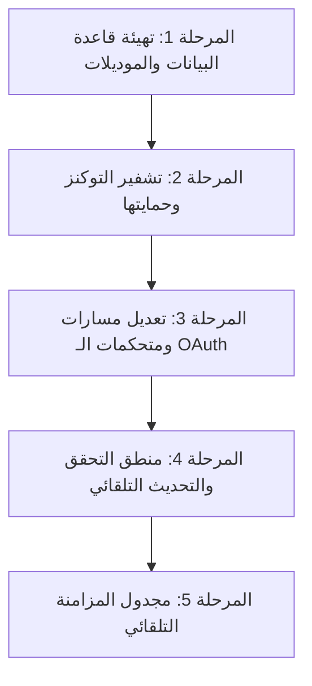

# خطة عمل متكاملة لربط المتاجر (سلة وزد) وتخزين التوكنز وتشفيرها بشكل احترافي

تهدف هذه الخطة إلى تفصيل الخطوات اللازمة لاستكمال وتطوير نظام ربط المتاجر (OAuth) في منصة **DashAI** على مستوى الإنتاج (Production-ready)، وذلك من خلال إنشاء الهياكل البرمجية اللازمة لإدارة وحفظ رموز التفويض (Tokens) مشفرة، وتحديثها تلقائياً، وربطها بالمستخدم المالك للمتجر.

---

## المخطط الزمني ومراحل التنفيذ



---

## 1. المرحلة الأولى: تهيئة قاعدة البيانات ونماذج Sequelize

لكي نتمكن من حفظ رموز الوصول، سنقوم بإنشاء جدول `store_tokens` المقابل للميجريشنز ليكون مربوطاً بعلاقة مباشرة (One-to-One) مع جدول `linked_stores`.

### 📝 الخطوات العملية:
1. **إنشاء ملف الميجريشن لجدول رموز التفويض:**
   ننشئ ملف هجرة جديد في `backend/database/migrations/` باسم `create-store-tokens.cjs`:
   * يحتوي على الحقول: `id` (رقمي تلقائي)، `store_id` (معرف المتجر مفتاح أجنبي فريد)، `access_token` (نص طويل)، `refresh_token` (نص طويل)، `manager_token` (خاص بزد فقط)، و `expires_at` (تاريخ ووقت انتهاء الصلاحية).
   * إضافة قيد المفتاح الأجنبي (Foreign Key) ليرتبط بجدول `linked_stores` مع خاصية `ON DELETE CASCADE`.

2. **إنشاء موديل Sequelize المخصص لـ `StoreToken`:**
   ننشئ ملف الموديل في **[StoreToken.js](file:///c:/Users/ZBook/Desktop/project-dashbord/backend/src/models/StoreToken.js)**:
```javascript
// models/StoreToken.js
import { DataTypes } from 'sequelize';
import sequelize from '../config/db.js';

const StoreToken = sequelize.define('StoreToken', {
  id: {
    type: DataTypes.INTEGER,
    autoIncrement: true,
    primaryKey: true
  },
  storeId: {
    type: DataTypes.INTEGER,
    allowNull: false,
    unique: true,
    field: 'store_id'
  },
  accessToken: {
    type: DataTypes.TEXT,
    allowNull: false,
    field: 'access_token'
  },
  refreshToken: {
    type: DataTypes.TEXT,
    allowNull: true,
    field: 'refresh_token'
  },
  managerToken: {
    type: DataTypes.TEXT,
    allowNull: true,
    field: 'manager_token'
  },
  expiresAt: {
    type: DataTypes.DATE,
    allowNull: false,
    field: 'expires_at'
  }
}, {
  tableName: 'store_tokens',
  timestamps: false
});

export default StoreToken;
```

3. **ربط العلاقات في ملف التصدير المركزي (`models/index.js`):**
   نقوم بتعريف العلاقات البرمجية لتسهيل جلب المتجر والتوكن الخاص به بخطوة واحدة:
```javascript
// في models/index.js
LinkedStore.hasOne(StoreToken, { foreignKey: 'storeId', as: 'tokens', onDelete: 'CASCADE' });
StoreToken.belongsTo(LinkedStore, { foreignKey: 'storeId', as: 'store' });
```

---

## 2. المرحلة الثانية: تشفير وحماية التوكنز (Crypto Utility)

لحماية أسرار التجار ورموز وصولهم في حال تم تسريب قاعدة البيانات، سنقوم بتطبيق تشفير متماثل قوي من نوع **AES-256-GCM** مدمج بالباك إند.

### 📝 الخطوات العملية:
1. إعداد مفتاح التشفير العشوائي في ملف الـ `.env`:
   `ENCRYPTION_KEY=64_character_hex_string_here` (مفتاح سري بطول 32 بايت ممثل بنظام الـ Hex).
2. إنشاء ملف مساعدة التشفير **[encryption.js](file:///c:/Users/ZBook/Desktop/project-dashbord/backend/src/utils/encryption.js)** ويضم دالتين:
   * `encrypt(text)`: تأخذ النص الخام (التوكن)، وتولد ناقل حركة (IV) عشوائي وتخرج النص مشفراً مدمجاً معه علامة المصادقة (Auth Tag).
   * `decrypt(encryptedText)`: تأخذ النص المشفر وتفك تشفيره وتعيده لحالته النصية الأصلية قبل استدعاء الـ APIs الخارجية.

---

## 3. المرحلة الثالثة: تعديل متحكمات الـ OAuth وحفظ التوكنز

سنقوم بتعديل متحكمات سلة وزد لحفظ التوكنز مشفرة في قاعدة البيانات فور نجاح التفويض.

### 📝 الخطوات العملية لـ سلة وزد:
1. في دالة الـ Callback بعد مقايضة الكود، نستلم:
   * `access_token`
   * `refresh_token`
   * `expires_in` (عدد الثواني لصلاحية التوكن، عادة 1209600 ثانية لـ 14 يوماً).
2. نقوم بحساب تاريخ الانتهاء الفعلي:
   `const expiresAt = new Date(Date.now() + expires_in * 1000);`
3. نقوم بتشفير التوكنز:
   `const encryptedAccess = encrypt(access_token);`
   `const encryptedRefresh = encrypt(refresh_token);`
4. نحفظ السجل في `linked_stores` أولاً لنحصل على معرف المتجر الجديد (`store.id`).
5. نقوم بإدراج أو تحديث (Upsert) السجل المكتوب في جدول `store_tokens` باستخدام المعرف المولد:
```javascript
await StoreToken.upsert({
  storeId: store.id,
  accessToken: encryptedAccess,
  refreshToken: encryptedRefresh,
  expiresAt: expiresAt
});
```

---

## 4. المرحلة الرابعة: منطق التحقق والتحديث التلقائي للتوكنز

تجنباً لتوقف العمليات أو انتهاء الجلسة أثناء جلب البيانات بالخلفية، سنبني طبقة وسيطة ذكية للتحقق التلقائي والتجديد.

### 📝 الخطوات العملية:
1. عند الرغبة في إجراء أي عملية (جلب منتجات أو طلبات)، نستدعي دالة وسيطة تسمى `getOrRefreshStoreToken(storeId)`:
   * تقوم هذه الدالة بالاستعلام عن التوكن الخاص بالمتجر من جدول `store_tokens`.
   * تفحص التوكن: هل تاريخ انتهاء صلاحيته (`expiresAt`) قد شارف على الانتهاء (مثلاً بقي أقل من ساعة واحدة)؟
   * **إذا كان نشطاً:** تفك تشفيره وتعيد الـ `accessToken` للعميل.
   * **إذا انتهى أو شارف على الانتهاء:**
     1. تفك تشفير الـ `refresh_token` المخزن.
     2. تتصل بسيرفر سلة/زد وترسل طلب تجديد (`grant_type = refresh_token`).
     3. تستقبل التوكنات الجديدة، وتقوم بتشفيرها وتحديثها في قاعدة البيانات وتحديث الـ `expiresAt` الجديد.
     4. تعيد توكن الوصول الجديد للملف المستدعي لمتابعة عمليته دون أي مقاطعة!

---

## 5. المرحلة الخامسة: مجدول المزامنة التلقائي (Cron Jobs)

بعد استقرار التوكنز وتحديثها، نقوم بجدولة مهام الخلفية لمزامنة المتاجر تلقائياً.

### 📝 الخطوات العملية:
1. تنصيب مكتبة جدولة المهام: `npm install node-cron`.
2. إنشاء مجلد مجدول المهام: `backend/src/jobs/syncStores.js`.
3. كتابة وظيفة تدور على كافة السجلات بجدول `linked_stores` كل 6 ساعات:
   * تستدعي دالة `getOrRefreshStoreToken(store.id)` للحصول على توكن نشط وآمن لكل متجر.
   * تستدعي المنتجات الجديدة والطلبات من سلة أو زد وتقوم بتحديث لوحة تحكم التاجر وقواعد البيانات محلياً.

---
### 📌 خلاصة الخطة الأمنية والهيكلية:
باتباع هذه المراحل الخمس، ينتقل خادم منصة DashAI إلى نظام مؤتمت بالكامل، محمي بتشفير AES، وقابل للتوسع اللامتناهي لدعم آلاف المتاجر دون تدخل يدوي من المطور أو التاجر لتجديد التوكنز أو التحقق من الجلسات!
