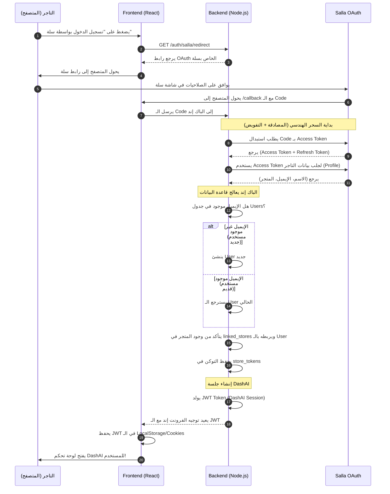

# الدليل الشامل والهندسي لنظام تسجيل الدخول الموحد (SSO) وربط المتاجر (سلة وزد)

## 📌 الفهرس
1. [مقدمة المفاهيم: المصادقة (Authentication) مقابل التفويض (Authorization)](#1-مقدمة-المفاهيم-المصادقة-authentication-مقابل-التفويض-authorization)
2. [السيناريو الأول: "ربط المتجر" (الوضع الحالي)](#2-السيناريو-الأول-ربط-المتجر-الوضع-الحالي)
3. [السيناريو الثاني: "تسجيل الدخول بواسطة سلة / زد" (الوضع المستهدف)](#3-السيناريو-الثاني-تسجيل-الدخول-بواسطة-سلة--زد-الوضع-المستهدف)
4. [الفروقات الجوهرية (مقارنة تفصيلية)](#4-الفروقات-الجوهرية-مقارنة-تفصيلية)
5. [تشريح منصة سلة وزد (كيف يفهمون الحسابات؟)](#5-تشريح-منصة-سلة-وزد-كيف-يفهمون-الحسابات)
6. [تصميم قاعدة البيانات الموحدة (Database Architecture)](#6-تصميم-قاعدة-البيانات-الموحدة-database-architecture)
7. [التدفق التقني خطوة بخطوة (Sequence Diagrams)](#7-التدفق-التقني-خطوة-بخطوة-sequence-diagrams)
8. [سيناريوهات معقدة وحالات الحافة (Edge Cases)](#8-سيناريوهات-معقدة-وحالات-الحافة-edge-cases)
9. [ما الذي يترتب على هذا القرار؟ (Impact Analysis)](#9-ما-الذي-يترتب-على-هذا-القرار-impact-analysis)
10. [خطة التنفيذ البرمجية (Implementation Plan)](#10-خطة-التنفيذ-البرمجية-implementation-plan)

---

## 1. مقدمة المفاهيم: المصادقة (Authentication) مقابل التفويض (Authorization)

لفهم الفكرة التي تطرحها بشكل عميق، يجب أن نفرق بين مصطلحين في عالم الـ OAuth 2.0 يتم الخلط بينهما دائماً:

### أ) المصادقة (Authentication - AuthN): "مَن أنت؟"
وهي عملية التحقق من **هوية المستخدم**. عندما تضغط على "تسجيل الدخول بواسطة Google"، أنت تقول لتطبيق معين: "أنا لا أريد إنشاء حساب بكلمة مرور لديكم، اسألوا جوجل عن هويتي (اسمي، إيميلي، صورتي)، وإذا وافق جوجل، أنشئوا لي حساباً عندكم بناءً على هذه المعلومات". 
هنا الهدف هو **تأسيس جلسة (Session) للمستخدم** في منصتك.

### ب) التفويض (Authorization - AuthZ): "ماذا يسمح لك بفعله؟"
وهي عملية إعطاء **صلاحيات**. عندما تضغط على "ربط المتجر"، أنت تقول لتطبيق (DashAI): "أنا أسمح لك بالدخول إلى متجري في سلة لقراءة الطلبات والمنتجات نيابة عني". 
هنا الهدف ليس معرفة من أنت، بل الهدف هو **الحصول على مفتاح (Access Token)** للتحكم بمتجرك.

> 💡 **ملاحظة هامة:** منصات مثل سلة وزد صُممت بروتوكولات الـ OAuth الخاصة بها أساساً لغرض **التفويض (Authorization)** (تثبيت التطبيقات على المتاجر). لكن، يمكننا بذكاء برمجي استخدام نفس البروتوكول لعمل **المصادقة (Authentication)** (تسجيل الدخول لمنصتك)، وهذا بالضبط ما تريد تحقيقه!

---

## 2. السيناريو الأول: "ربط المتجر" (الوضع الحالي)

في هذا السيناريو (وهو الذي كنت تقوم بتجربته مؤخراً)، العملية تتم كالتالي:

1. **الخطوة المسبقة:** التاجر يقوم بالدخول إلى منصتك (DashAI) وإنشاء حساب بالطريقة التقليدية (إيميل + كلمة مرور).
2. **تسجيل الدخول:** التاجر يسجل دخوله لمنصتك، وتتكون له جلسة (JWT أو Session).
3. **عملية الربط:** يذهب التاجر إلى صفحة "المتاجر" ويضغط على زر "ربط مع سلة".
4. **التوجيه لسلة:** يتم توجيه التاجر إلى سلة. سلة تسأله: "هل توافق على إعطاء تطبيق DashAI صلاحية قراءة متجرك؟"
5. **العودة:** يوافق التاجر، ويعود إلى منصتك.
6. **الحفظ:** منصتك تأخذ التوكن من سلة، وتربطه بـ `user_id` الخاص بالتاجر الذي سجل دخوله مسبقاً.

**مميزات هذا السيناريو:**
- المستخدم (التاجر) هو محور النظام، ويمكنه ربط أكثر من متجر سلة وزد بنفس الحساب.
- النظام بسيط ومباشر.

**عيوب هذا السيناريو:**
- التاجر يضطر لعمل حساب جديد بكلمة مرور جديدة في منصتك، مما يزيد من خطوات الـ (Onboarding).

---

## 3. السيناريو الثاني: "تسجيل الدخول بواسطة سلة / زد" (الوضع المستهدف)

في هذا السيناريو (وهو ما يشبه تسجيل الدخول بـ Google)، العملية تدمج المصادقة والتفويض في خطوة واحدة سحرية للمستخدم:

1. **البداية:** التاجر يدخل إلى صفحة تسجيل الدخول في منصتك (DashAI). لا يجد حقول "إنشاء حساب"، بل يجد زر ضخم: **"تسجيل الدخول السريع عبر سلة"**.
2. **التوجيه لسلة:** بمجرد الضغط، يتم توجيهه لسلة. سلة تسأله: "هل توافق على إعطاء تطبيق DashAI صلاحيات...؟"
3. **العودة:** يوافق التاجر ويعود لمنصتك.
4. **السحر البرمجي (في الباك إند):**
   - منصتك تستلم التوكن من سلة.
   - منصتك تستخدم التوكن لجلب (إيميل التاجر، اسمه، معرف سلة الخاص به).
   - منصتك تسأل قاعدة البيانات: "هل هذا الإيميل أو معرف سلة موجود مسبقاً في جدول المستخدمين؟"
   - **إذا لم يكن موجوداً:** تقوم منصتك بإنشاء **حساب مستخدم جديد (User)** وتنشئ له **متجر مرتبط (LinkedStore)** وتخزن **التوكن (StoreToken)**.. كل هذا في جزء من الثانية بالخفاء!
   - **إذا كان موجوداً:** تقوم منصتك بتسجيل دخوله وتحديث التوكن الخاص بمتجره.
5. **النهاية:** يتم توليد JWT (جلسة دخول لمنصتك) وتوجيه التاجر إلى لوحة تحكم DashAI وهو مسجل الدخول، ومتجره مربوط جاهز!

**مميزات هذا السيناريو:**
- تجربة مستخدم (UX) خرافية وسلسة جداً (Frictionless). التاجر بضغطة زر واحدة أصبح لديه حساب في منصتك ومتجره مربوط.
- لا حاجة لإدارة كلمات مرور ونسيانها واستعادتها.

**عيوب هذا السيناريو:**
- هندسة الباك إند أكثر تعقيداً.
- معالجة الحالات المعقدة (ماذا لو أراد نفس التاجر ربط متجر Zid لاحقاً؟ كيف نربطه بنفس الحساب الذي تم إنشاؤه عبر سلة؟).

---

## 4. الفروقات الجوهرية (مقارنة تفصيلية)

| وجه المقارنة | السيناريو 1 (حساب محلي + ربط لاحق) | السيناريو 2 (تسجيل الدخول بالسوشيال/سلة) |
| :--- | :--- | :--- |
| **خطوات البدء (Onboarding)** | طويلة (إنشاء حساب -> تفعيل -> تسجيل دخول -> ربط المتجر) | قصيرة جداً (ضغطة واحدة -> الحساب تم إنشاؤه والمتجر تم ربطه) |
| **جدول المستخدمين (Users)** | يحتوي على (Email, Password Hash, Name) | يحتوي على (Email, Salla_ID, Zid_ID, Name). لا يوجد Password! |
| **حماية الحسابات** | مسؤوليتك (حماية تشفير كلمات المرور) | مسؤولية سلة/زد (أنت تعتمد على قوة حمايتهم) |
| **ربط عدة منصات معاً** | سهل جداً (لأنه مسجل دخول بحسابه المحلي، ويمكنه ربط أي عدد من المتاجر) | يحتاج ذكاء هندسي (إذا دخل بسلة، ثم غداً دخل بزد، يجب أن يتعرف النظام أنه نفس الشخص من خلال الإيميل لدمج الحسابين). |
| **استقلالية المنصة** | عالية (تطبيقك منفصل تماماً، والربط إضافة) | منخفضة (إذا سقط سيرفر سلة، لن يستطيع التاجر تسجيل الدخول لتطبيقك!) |

---

## 5. تشريح منصة سلة وزد (كيف يفهمون الحسابات)

من المهم جداً قبل تصميم جدول المستخدمين أن تفهم كيف تعمل واجهات (APIs) سلة وزد.

### في منصة سلة (Salla):
- الحساب في سلة مبني على **التاجر (Merchant)**.
- التاجر يمكن أن يملك **عدة متاجر (Stores)**.
- عندما تقوم بعمل OAuth، أنت تحصل فعلياً على توكن **لمتجر محدد (Store)**، ولكن في بيانات الـ Profile الراجعة، سلة تعطيك بيانات الـ Merchant (الاسم، الإيميل، الجوال).
- **الخطر هنا:** ماذا لو كان التاجر "أحمد" يملك "متجر العطور" و "متجر الأحذية" في سلة؟
  - إذا سجل الدخول بمتجر العطور، ستحصل على (Token A) واسم أحمد وإيميله.
  - إذا عاد وسجل الدخول بمتجر الأحذية، ستحصل على (Token B) ونفس اسم أحمد وإيميله.
  - **السؤال الهندسي:** هل تنشئ له حسابين في منصتك DashAI أم حساب واحد يحتوي على متجرين؟ (الصحيح هندسياً هو إنشاء **حساب واحد** بناءً على الإيميل الموحد، وربط متجرين بجدول `linked_stores`).

### في منصة زد (Zid):
- زد لديهم بنية مشابهة، لكن توكن زد (Manager Token) أحياناً يكون مرتبطاً بالمدير الموظف وليس المالك! يجب أن نعتمد الإيميل كـ (Unique Identifier) أساسي لجمع المتاجر تحت مستخدم واحد.

---

## 6. تصميم قاعدة البيانات الموحدة (Database Architecture)

لتطبيق فكرة "تسجيل الدخول عبر سلة/زد" بامتياز، يجب بناء الجداول كالتالي (هذا هو التصميم الاحترافي الذي يجب أن نعتمده):

### أ) جدول المستخدمين `users` (المحور الأساسي)
يمثل "الإنسان" (التاجر) الذي يدخل لمنصة DashAI.
- `id`: UUID أو Integer
- `email`: الإيميل الأساسي (يكون Unique لدمج الحسابات).
- `name`: اسم التاجر.
- `avatar`: صورة التاجر الشخصية (إن وجدت).
- `password`: **(نتركه Null أو نلغيه تماماً)** لأن تسجيل الدخول يعتمد على OAuth.
- `salla_merchant_id`: معرف التاجر في سلة (إن وجد).
- `zid_manager_id`: معرف التاجر في زد (إن وجد).
- `last_login`: لتتبع النشاط.

### ب) جدول المتاجر المرتبطة `linked_stores`
يمثل "المتاجر" التي يملكها هذا الإنسان. المستخدم الواحد قد يملك متجرين في سلة ومتجر في زد.
- `id`: UUID (مثال: `550e8400-e29b-41d4-a716-446655440000`)
- `user_id`: يربط المتجر بالـ `User` (Foreign Key).
- `platform`: نوع المنصة (`salla` أو `zid`).
- `platform_store_id`: معرف المتجر في منصة سلة أو زد (مثال: `store_12345`).
- `store_name`: اسم المتجر (مثال: "متجر العطور").
- `store_domain`: رابط المتجر (مثال: `perfumes.com`).

### ج) جدول رموز التفويض `store_tokens`
يمثل "مفاتيح الدخول" لكل متجر (وقد قمنا بإنشائه في الخطوة السابقة!).
- `id`: Integer
- `store_id`: يربط التوكن بالمتجر `linked_stores.id` (Foreign Key).
- `access_token`: مفتاح الدخول للمتجر.
- `refresh_token`: مفتاح التجديد.
- `manager_token`: مفتاح مدير زد.
- `expires_at`: تاريخ انتهاء الصلاحية.

---

## 7. التدفق التقني خطوة بخطوة (Sequence Diagrams)

لفهم كيف سيتخاطب الفرونت إند والباك إند وسلة، انظر إلى هذا المخطط:

---

## 8. سيناريوهات معقدة وحالات الحافة (Edge Cases)

عند تصميم نظام يعتمد كلياً على سلة/زد لتسجيل الدخول، ستواجه الحالات التالية التي يجب أن نصمم لها حلولاً برمجية منذ الآن:

### الحالة أ: التاجر يدخل بسلة، ثم يريد ربط متجره الآخر في زد
1. التاجر يضغط "تسجيل دخول بسلة". النظام ينشئ له حساب بناءً على إيميل `ahmed@gmail.com`.
2. التاجر أصبح داخل لوحة تحكم DashAI الخاص بك.
3. التاجر لديه متجر آخر في زد، فيضغط زر "ربط مع زد" من داخل لوحة التحكم.
4. **التحدي:** كيف يعرف النظام أن هذا المتجر في زد يجب أن يتبع لحساب "أحمد" وليس لحساب جديد؟
5. **الحل:** بما أن التاجر مسجل دخول أصلاً ولديه JWT الخاص بمنصتك، الباك إند سيعرف هويته (`req.user.id`). عندما يعود من الـ OAuth الخاص بزد، الباك إند سيأخذ التوكن ويربطه بمتجر Zid تحت نفس الـ `req.user.id`.

### الحالة ب: تغيير الإيميل في منصة سلة
- إذا قام التاجر بتغيير إيميله في منصة سلة، ثم سجل دخول لمنصتك مرة أخرى، الباك إند سيبحث عن الإيميل الجديد ولن يجده! فسيقوم بإنشاء مستخدم جديد منفصل!
- **الحل:** يجب أن نعتمد على `salla_merchant_id` كمعرف أساسي للبحث بجانب الإيميل.

### الحالة ج: ماذا لو أراد التاجر دعوة موظفيه للوحة DashAI؟
- إذا كان تسجيل الدخول مقتصراً فقط على زر "الدخول بسلة"، فلن يستطيع الموظفون (الذين لا يملكون حساب مالك في سلة) الدخول إلى لوحة DashAI الخاصة بالتاجر.
- **الحل المستقبلي:** قد تضطر لبناء نظام تسجيل دخول محلي (إيميل وباسورد) خاص بالموظفين فقط (Sub-accounts)، بينما المالك يدخل بالسوشيال.

---

## 9. ما الذي يترتب على هذا القرار؟ (Impact Analysis)

الاعتماد على نظام "تسجيل الدخول عبر المتجر" يترتب عليه الأمور التالية:

1. **انخفاض هائل في الاحتكاك (Friction):** زبائنك (التجار) سيحبون منصتك لأنهم يدخلونها بضغطة زر دون الحاجة لتذكر كلمات مرور جديدة.
2. **تبسيط واجهة المستخدم (UI):** صفحة تسجيل الدخول ستكون عبارة عن واجهة نظيفة جداً تحتوي على زرين فقط: "الدخول عبر سلة" و "الدخول عبر زد".
3. **أمان معتمد (Delegated Security):** أنت ترفع عن كاهلك مسؤولية اختراق كلمات المرور، لأن سلة وزد هم من يتحملون مسؤولية التحقق من هوية التاجر وحماية حسابه بـ (Two-Factor Authentication).
4. **تحدي الـ Session Management:** يجب عليك بناء نظام JWT قوي جداً في منصتك، بحيث أن التاجر بعد أن يعود من سلة، تعطيه منصتك "مفتاح مرور داخلي JWT" ليتنقل بين صفحات منصتك بأمان تام.

---

## 10. خطة التنفيذ البرمجية (Implementation Plan)

إذا قررنا السير في هذا الطريق (وهو الطريق الذي أنصحك به بشدة لأنه الأكثر حداثة واحترافية كمنصة B2B SaaS)، فهذه هي الخطوات البرمجية التي سنقوم بتنفيذها تباعاً:

### الخطوة 1: الميجريشنز (Migrations)
- إنشاء ميجريشن لجدول `Users` (الذي لا يحتوي على باسورد).
- إنشاء ميجريشن لجدول `linked_stores` (يربط المتجر باليوزر).
- (لقد أنشأنا بالفعل جدول `store_tokens` في الخطوات السابقة!).

### الخطوة 2: طبقة الخدمة (Service Layer)
- بناء خدمة `jwtService.js` في الباك إند وظيفتها توليد توكن (Session) لمنصة DashAI.

### الخطوة 3: تعديل الـ Callback (الجوهر)
- تعديل الكود الذي قمنا بكتابته اليوم، ليقوم بعمل التالي بالترتيب:
  1. جلب التوكن من سلة.
  2. جلب الـ Profile.
  3. `User.findOrCreate` (باستخدام الإيميل).
  4. `LinkedStore.findOrCreate` (مع `userId = user.id`).
  5. `StoreToken.upsert` (مع `storeId = store.id`).
  6. توليد `JWT`.
  7. توجيه الفرونت إند مع الـ JWT في الرابط أو في الـ Cookies (مثل: `/dashboard?token=eyJhbG...`).

### الخطوة 4: حماية المسارات (Middleware)
- تحويل `verifyToken.js` ليقوم بفك تشفير الـ JWT الصادر من منصتك والتأكد أن الجلسة صالحة.

### خلاصة القرار:
هذا النمط (OAuth as Identity Provider) هو نفس النمط الذي تستخدمه المنصات العالمية (مثل منصات التسويق التي تقول لك "سجل دخولك بواسطة Shopify"). 
تطبيقه يحتاج دقة هندسية (وهو ما تم شرحه هنا)، لكنه النقلة النوعية الأكبر في تجربة المستخدم لمنصتك!
